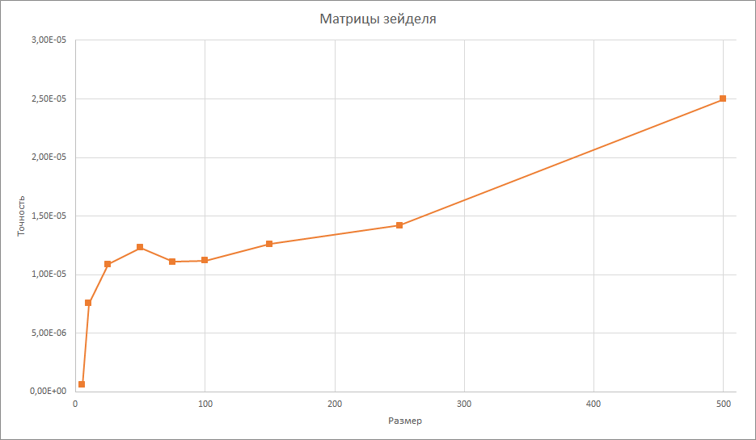

## Постановка задачи

Дана квадратная матрица. Используя метод вращений Якоби, найти её собственные значени и собственные векторы с заданной точностью.

## Описание метода

Метод вращений Якоби является методом решения полной проблемы собственных значений вещественной симметричной матрицы. Он основан на построении последовательности матриц, которые ортогонально подобны исходной матриц и имеют монотонно убывающие до нуля суммы всех внедиагональных элементов

Итерационный процес осуществляется следующим образом:

* В матрице $A_k$ определяется максимальный по абсолютной величина элемент $a^{(k)}_ij$
* Строится матрица вращения $T_{ij}=$ 
  
  Угол $\theta$ выбирается так, чтобы в матрице $A_{k+1}$ обратился в нуль элемент $a^{(k)}_{ij}$. Из этого условия можно получить

  $\tg 2\theta = \frac{2a^{(k)}_{ij}}{a^{(k)}_{ii}-a^{(k)}_{jj}}; |\theta|\leq \frac{\pi}{2}$

* Получаем новую матрицу $A_{k+1}=T^T_{ij}A_kT_{ij}$
* Вычисление заканчивается при обращении в 0 всех недиагональных элементов матрицы

В итоге матрица $A_k$ сходится к диагональной матрице $\Lambda$ при $k\to\infty$. Тогда приближенными значениями собственных чисел матрицы A будут диагональные элементы матрицы $A_k$, а приближенными значениями собственых векторов - столбцы матрицы $T_k=\prod\limits_{v=1}^k T_{v-1} T_{ij_{v}}$

## Результаты решения задач

### Симметричные матрицы с диагональным преобладанием

Размер: 10

| k | Количество итераций | Точность |
| --- | --- | --- |
| 0 | 118 | 8,1E-6 |
| 1 | 117 | 6,6E-6 |
| 3 | 120 | 7,5E-6 |
| 5 | 120 | 6,7E-6 |
| 15 | 100000 | 0,375 |

Размер: 25

| k | Количество итераций | Точность |
| --- | --- | --- |
| 0 | 893 | 8E-6 |
| 1 | 869 | 7,2E-6 |
| 3 | 862 | 6,18E-6 |
| 5 | 884 | 6,58E-6 |
| 15 | 100000 | 0,625 |

Размер: 50

| k | Количество итераций | Точность |
| --- | --- | --- |
| 0 | 3642 | 9,95E-6 |
| 1 | 3643 | 9,25E-6 |
| 3 | 3624 | 8,81E-6 |
| 5 | 3655 | 7,94E-6 |
| 15 | 100000 | 2,875 |

### Матрицы гилберта

| Размер | Количество итераций | Точность |
| --- | --- | --- |
| 5 | 24 | 5,79E-7 |
| 10 | 76 | 7,55E-6 |
| 25 | 270 | 1,09E-5 |
| 50 | 618 | 1,23E-5 |
| 75 | 1013 | 1,11E-5 |
| 100 | 1553 | 1,12E-5 |
| 150 | 2440 | 1,26E-5 |
| 250 | 4184 | 1,42E-5 |
| 500 | 9249 | 2,5E-5 |

## Выводы

Проанализировав выполненную работу, можно сделать следующий вывод о рассмотренном методе

* Метод Якоби находит собственные значения и векторы с хорошей точностью
* При росте числа обусловленности матрицы, количество итераций необходимых для достижения заданной точности тоже увеличивается
* При увеличении размера матрицы, точность полученных данных при одинаковых условиях выхода уменьшается